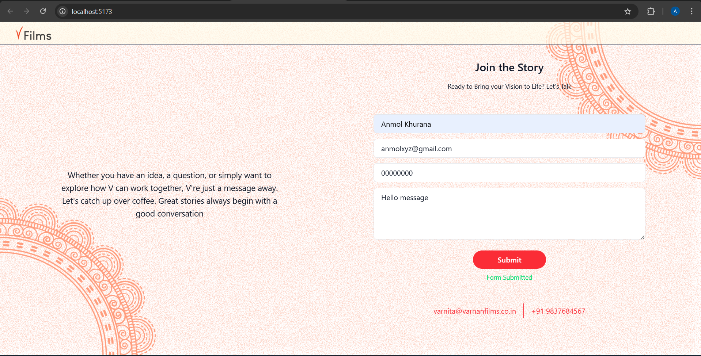

# EZ Works Assignment (React)

A React contact form application built with Vite, Tailwind CSS, and React Hook Form.



## Features
- React functional components with hooks
- Tailwind CSS for styling
- React Hook Form for validation
- Axios for API calls
- Contact form with email/phone validation

## Prerequisites
- Node.js >= 14
- npm or yarn

## Setup & Run
```bash
cd client
npm install
npm run dev
```
App runs at http://localhost:5173

## Build
```bash
npm run build
```

## API Endpoint
- POST `/api/contact-us/` at `https://vernanbackend.ezlab.in`

## Project Structure
```
src/
├── views/
│   ├── App.jsx
│   └── components/
├── viewmodels/
│   └── ContactViewModel.js
└── api/
    └── ContactApi.js
```

- `views/`: React Views and components
- `viewmodels/`: Form state management with React Hook Form
- `api/`: API interaction with Axios